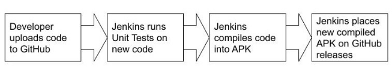

Drew Snarski

7/23/2022

**Implementation Of An Android Build Pipeline With Integrated Unit Testing For The Deployment Of Rigorous Software**

**Introduction**	

It is very easy to code some application by yourself, and when developing an Android application, or APK, Android Studio is an amazing resource to use. But what about when multiple people need to work on it? Do you need to send the APK to everyone individually? To every other coder, tester, user, and anyone else? How do you make sure that there is a single source of truth that can be accessed? You need version control. GitHub is an amazing tool handling these requirements, but it does not compile all the code automatically and release it in an APK format. Doing so requires a more in-depth process. 

*Tasks*

That is where the build pipeline comes in. Through this build pipeline, in this case, Jenkins, each branch of a GitHub repository will be compiled, ran through a series of unit tests, then, upon completion of the unit tests, will be sent back to GitHub in the releases tab so that anyone can download the latest version. 

Now, to set this up, I had to configure, deploy, and host my Jenkins webserver. 

*Previous Experiences*

I have had some previous experience in deploying webservers from a class I took in the last semester, my ITM Capstone class, where the goal of the class was to deploy a multi-tiered webserver. I also had to add some supporting files to my repository I will be using to make the Android APK, which I conveniently had from a previous Android Development class, which is a CTA Train Tracking app. 

*Desired Outcomes*

The goal of this project was to deploy my webserver and then take my Android app to turn that into an APK for release.

**Components**

Modern software development is a complex process. 

*Android*

First, Android. Android is a Java-based development language maintained by Google. Android powers Android phones, obviously, but also runs a variety of other hardware, for example Smart TVs. Most Android development is done within Android Studio. Android Studio both houses the code, as well has a built-in emulator to run the code as soon as you are ready to do so. I also installed an SDK manager called *commandlinetools*, which will manage how the code is to be built. 

*Jenkins, Proxmox, and Terraform*

Jenkins is, from their website “the leading open source automation server, Jenkins provides hundreds of plugins to support building, deploying and automating any project (Jenkins.io).” Many people start with Jenkins as it is easy to use but can be outgrown quickly. But when developing with more than one person, Jenkins is a must. The Jenkins server will be hosted on a school-run remote server which I am able to access via Proxmox (Proxmox.com) The servers are maintained and provisioned by the ITM department for undergrad research use. Proxmox VE is a complete open-source platform for enterprise virtualization running on Debian Linux with a user API for infrastructure deployment via automation tools. I am also using Terraform, which is responsible for understanding API interactions. This makes it so my code will correctly tell Proxmox how to configure the server. 

*Unit Tests and JUnit*

Lastly, Unit tests. Unit tests are tests that are built into your code you’re developing to catch any errors. These tests will make sure your app will behave correctly when encountering any situation. I will show some examples of my unit tests running later. Junit, an external site, host very easy-to-use testing framework for Java, as well as provide any functions I may need to import into my code. 

**Building**

`	`The first step of this process was deploying the webserver. Like I mentioned earlier, I had already done something similar, so I was able to re-use some of the previous code that sent the webserver to be built on Proxmox. 

*Troubleshooting and licensing errors*

But I still had to configure that webserver to run Jenkins. And if you have ever done automatic deploying of software, you know there are always errors. I had to change my multi-tiered webserver into a single tier, and by doing so, had to change a lot of variables in order get my Terraform running correctly so that it could be built for Proxmox. I also needed to add something to manage the SDKs so that the APKs could be build. I added a zip file called *commandlinetools*, which had a lot of what I was looking for, but not everything. I still had to install a few more things before the SDK managers were done. A side-goal of this project was to have the deployment of the Jenkins server automated so that it is easy to re-deploy in the future. But, as I learned through this process, it could never be fully automated. You see, there are these little things called licensing agreements that tend to get in the way of automated deployment because you cannot automatically accept the licensing agreements, as that would be illegal. So, every time you deploy this Jenkins webserver, you need to manually accept the licensing agreements. But now that that’s done, its deployed! 

*GitHub Configuration*

Now what? Well, next is to configure your GitHub project, in both Jenkins and GitHub itself. For an automated deployment, I added [GitHub Hub](C:\Users\brew1\Desktop\Github.com\hub) to my webserver to handle this. Hub has commands that can be run after my app finishes building to automatically send it to the releases tab in the GitHub repository. As for the GitHub repository itself, you’ll need to add something called a Jenkinsfile. When building, Jenkins will find this Jenkinsfile, which tells it in what steps to test, build, and deploy. 

pipeline {

agent any

stages {

stage ('Test App'){

steps{

script{

sh 'chmod +x gradlew'

sh './gradlew test'

}}}

stage('Build App') {

steps {

script {

sh 'chmod +x gradlew'

sh './gradlew assembleDebug'

}}}

stage('Deploy') {

steps {

script {

echo 'Deploying Android APK to GitHub Release Tab...'

sh '/home/vagrant/sample-app-release-script.sh'

}}}

}}

After the build process is finished, the compiled APK is then deployed to my GitHub releases page. 

*Figure 1*

The app has been fully built and automatically deployed to my GitHub repository and can be viewed by anyone to download. 

*Implementing Unit Testing*

So, after troubleshooting my way through getting my code to build correctly, I implemented by Unit tests. For any single app, a developer could write hundreds upon hundreds of various unit tests. But for in my case, I only chose to implement two test to show off that unit testing could be implemented in the automated building phase.  I had two tests. One that tested to see if the username field was left empty, and another to see if the entered username was in a valid email format. Here is the build failing because an entered username was invalid: 

*Figure 2*

Along with the invalid email address: 

*Figure 3*

And the error in Android Studio itself: 

*Figure 4*

And then with it succeeding: 

*Figure 5*

With a valid email address: 

*Figure 6*

As well as the output: 

*Figure 7*

Unit tests can get much more complicated that what I currently have, but as I mentioned earlier, my app does not need anything more than that. Junit (Junit.org/junit5), which is the framework for unit testing, has a lot more information on way more complex user testing, which is worth checking out. 

**Conclusion**

`	`Automation is a large part of deploying software yet look at how needed to be done to automate a deployment of an Android application. These compilers were not built for automated deployment of apps. And unless you actively work for Google, you need to make a very similar system if you want to automate deployment of apps. The system I created works very well for what I needed it for and can be upscaled quite a bit. But what about when I need more that what Jenkins can offer? Then what? When designing new compiling tools, maybe we should think more about automated deployment and the ability for multiple people to be able to work on the code at once without disturbing the source of truth. But until them, developers will make do with what they have. 

